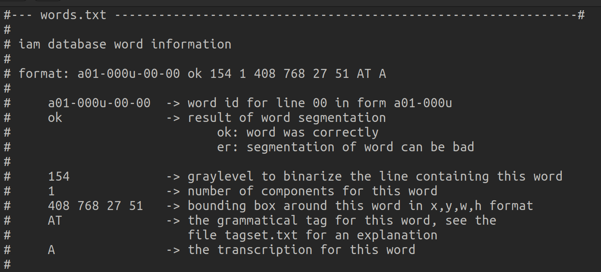
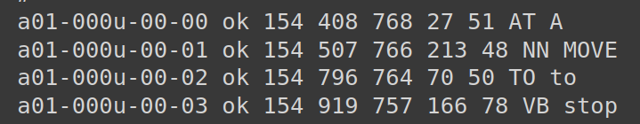
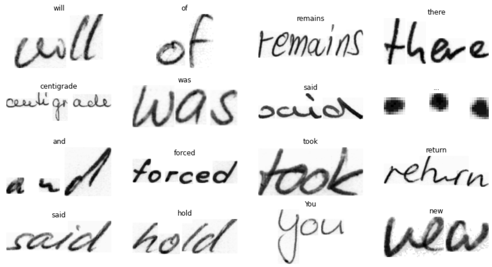
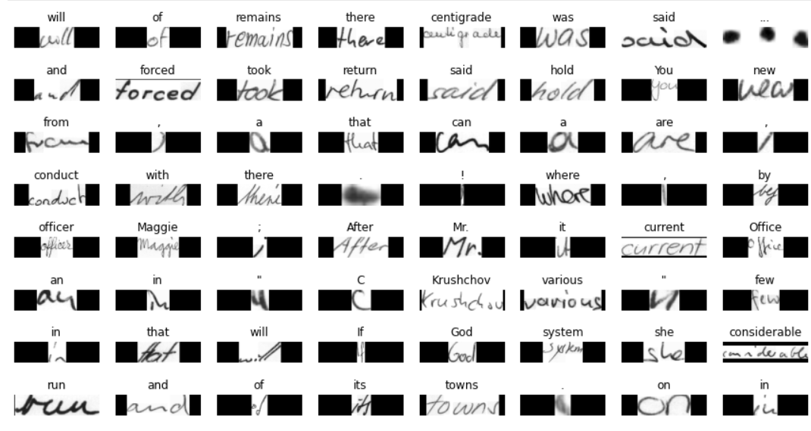
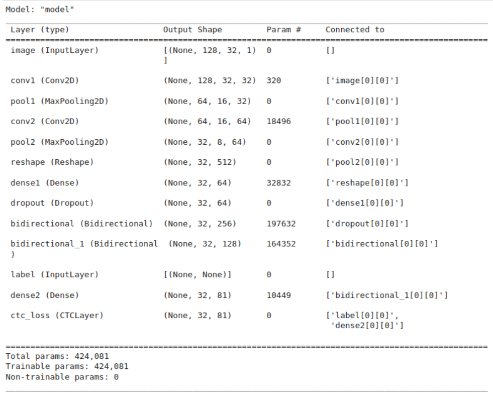
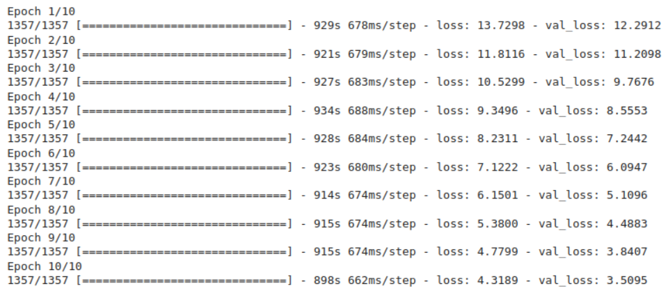
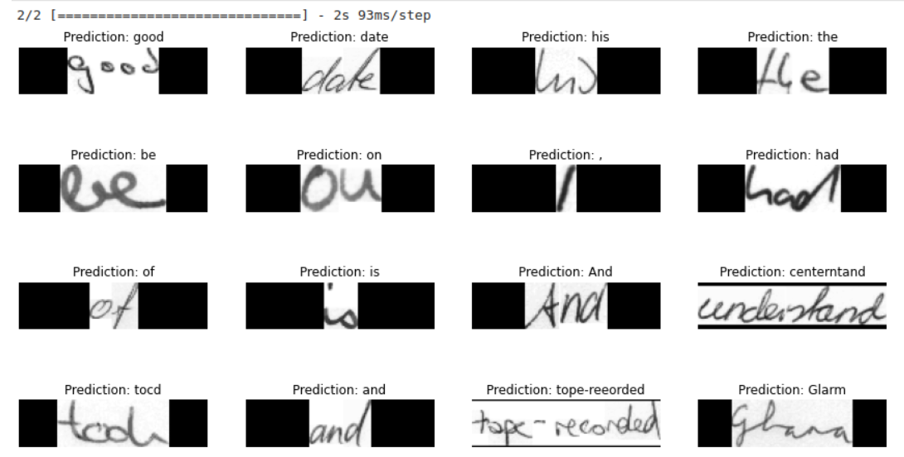

# Handwritten-Text-Recognition
Trained a Machine Learning Model to recognize handwritten English words. Used CNN layers for extracting relevant features from the image, LSTM to propogate information throughout the text sequence, and finally used CTC(Connectionist Temporal Classification) loss to find the highest probability alignment between input and target.

## Dataset : IAM Handwriting Dataset
The IAM Handwriting Database contains forms of handwritten English text. Given below is the structure of data

Examples of data points : 

## Preprocessing
**Data before preprocessing :**

All images were of different sizes; Converted all images to a constant size of 32 x 128 and added even padding on all sides to fill empty spaces.

Some of the incorrectly segmented images were removed

Word Length was diferent for every point; Converted all words to a vector of the same size of the largest word in the corpus, each character was mapped to an integer value and the vector was filled using those values, the remaining empty places were filled by a placeholder value.

Normalized the image matrix values

**Data after preprocessing :**

**Train : Test : Validation Split --> 90% : 5% : 5%**

## Model Architecture and training :

There still is room for loss to go down by increasing the epochs

## Predictions :

